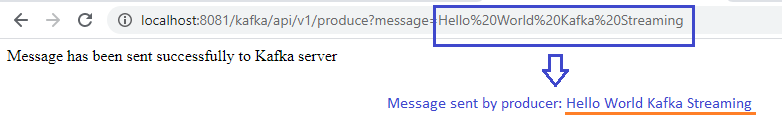
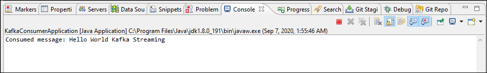
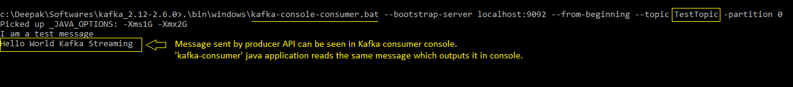

# Kafka Consumer

Applications that need to read data from Kafka use a KafkaConsumer to subscribe to Kafka topics and receive messages from these topics. It is a client or a program, which consumes the published messages from the Producer.

This application demonstrates that how consumer application received message (and outputs to console) which are sent by producer rest-api in application 'kafka-producer'.

## Steps to be followed

* Start Zookeeper (default port is 2181)

```
.\bin\windows\zookeeper-server-start.bat .\config\zookeeper.properties
```

* Kafka broker/server (default port is 9092)

```
.\bin\windows\kafka-server-start.bat .\config\server.properties
```

* Create Topic with 1 Partition and 1 Replica

```
.\bin\windows\kafka-topics.bat --create --zookeeper localhost:2181 --replication-factor 1 --partitions 1 --topic HelloWorldTopic
```

* Start Consumer

```
.\bin\windows\kafka-console-consumer.bat --bootstrap-server localhost:9092 --from-beginning --topic HelloWorldTopic –partition 0
```

* Run Spring Boot application

	[project: kafka-producer]
	Run 'com.example.kafka.KafkaProducerApplication.java' as Java Application
	
	[project: kafka-producer]
	
	Run 'com.example.kafka.KafkaConsumerApplication.java' as Java Application

## Few Results

- Rest API sent a message to Kafka Consumer



- Kafka consumer received message sent by Kafka producer



- Message sent by producer API can be seen in Kafka consumer console as well. 'kafka-consumer' java application reads the same message which outputs it in console.


